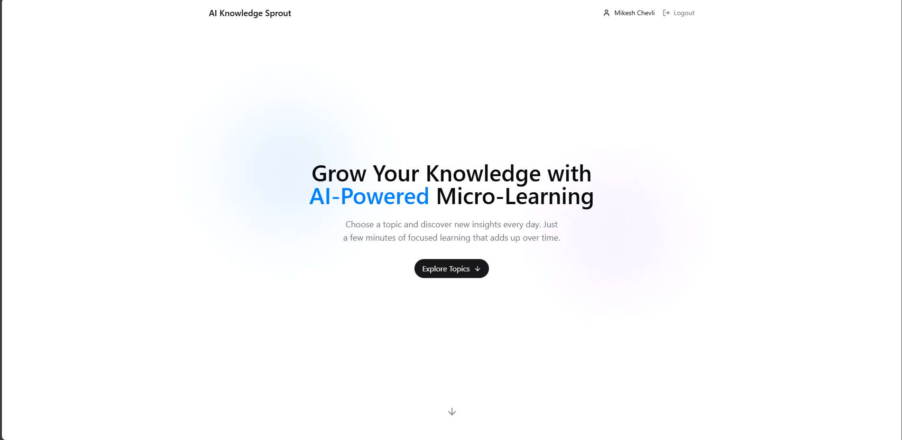
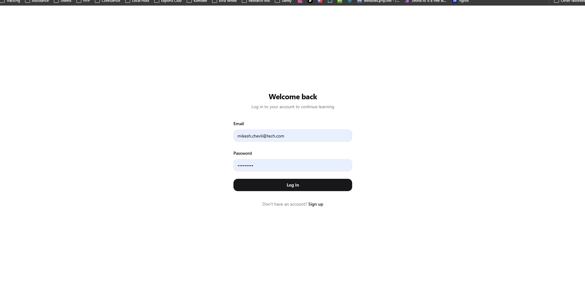
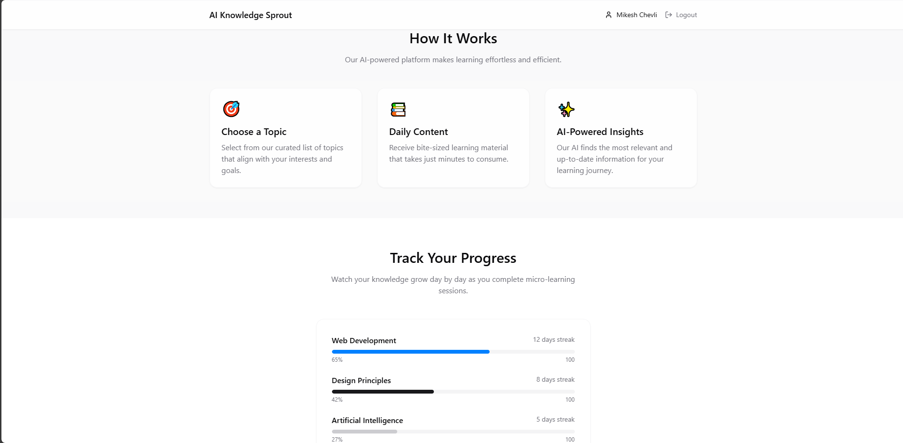

# 🌱 AI Knowledge Sprout - Daily Micro Learning App

A modern web application that delivers daily micro-learning content powered by AI.  
Users can select topics of interest and receive bite-sized knowledge to build expertise over time.

---

## ✨ Features

- **User Authentication**: Secure signup and login with JWT-based authentication
- **Topic Selection**: Choose from curated topics to focus your learning
- **AI-Generated Content**: Receive fresh, relevant content tailored to your interests
- **Progress Tracking**: Monitor your learning journey with visual progress indicators
- **Daily Learning Streaks**: Build consistency through daily learning sessions
- **Responsive Design**: Beautiful interface that works on any device
- **Smooth Animations**: Elegant transitions and micro-interactions
- **Form Validation**: Robust form validation using Zod and React Hook Form

---

## 🚀 Getting Started

### 1. **Prerequisites**

- Node.js (v14 or higher)
- MongoDB database
- npm or pnpm

### 2. **Environment Variables**

Create a `.env` file with:

```env
MONGODB_URI=your_mongodb_connection_string
VITE_API_URL=http://localhost:3000/api
JWT_SECRET=your_jwt_secret_key
VITE_OPENAI_API_KEY=your_openai_api_key
```

### 3. **Installation**

```sh
git clone https://github.com/Web-Dev-Kombee/daily-micro-learning.git
cd ai-knowledge-sprout
```

### 4. **Install Dependencies**

```sh
pnpm install
```

### 5. **Start Development Servers**

```sh
pnpm dev:all
```

### 6. **View the App**

Open your browser and navigate to `http://localhost:8080/`

---

## 🛠️ Technologies Used

- **Frontend**:

  - React with TypeScript
  - Tailwind CSS for styling
  - Shadcn/UI components
  - React Router for navigation
  - React Query for data fetching
  - Zod for form validation
  - React Hook Form for form management

- **Backend**:
  - Express.js server with TypeScript
  - MongoDB with Mongoose
  - JWT for authentication
  - bcrypt for password hashing
  - CORS for cross-origin requests

---

## 📁 Project Structure

```
src/
├── components/             # Reusable UI components
│   ├── auth/              # Authentication components
│   │   ├── LoginForm.tsx        # Login form with validation
│   │   └── SignupForm.tsx       # Signup form with validation
│   ├── AnimatedTransition.tsx   # Smooth transitions between states
│   ├── Header.tsx               # App header component
│   ├── LearningCard.tsx         # Content display component
│   ├── ProgressIndicator.tsx    # Visual progress tracking
│   └── TopicSelector.tsx        # Topic selection interface
├── contexts/              # React contexts
│   ├── AuthContext.ts           # Authentication context types
│   └── AuthProvider.tsx         # Authentication provider component
├── hooks/                 # React custom hooks
│   ├── useAuth.ts              # Authentication hook
│   ├── useLearning.ts          # Learning content management
│   └── useTopics.ts            # Topic data management
├── lib/                   # Utility functions and configurations
│   ├── api.ts                   # API service with auth
│   └── validations/             # Form validation schemas
│       └── auth.ts              # Authentication schemas
├── pages/                 # Application pages
│   ├── auth/                    # Authentication pages
│   │   ├── LoginPage.tsx       # Login page
│   │   └── SignupPage.tsx      # Signup page
│   ├── Index.tsx                # Landing page
│   ├── Topic.tsx                # Topic details and learning content
│   └── NotFound.tsx             # 404 page
├── types/                 # TypeScript type definitions
│   └── index.ts                 # Shared types
├── utils/                 # Utility functions
│   └── animations.ts            # Animation helpers
├── App.tsx               # Main app component with routing
└── index.css             # Global styles

server/                   # Backend server
├── index.ts              # Express server setup
└── models/               # MongoDB models
    ├── User.ts           # User model
    ├── LearningContent.ts # Content model
    ├── UserProgress.ts    # Progress model
    └── Topic.ts           # Topic model
```

---

## 🔑 Authentication Features

### User Registration

```javascript
// Example registration validation schema
const registrationSchema = z
  .object({
    email: z.string().email("Must be a valid email"),
    password: z
      .string()
      .min(8, "Password must be at least 8 characters")
      .regex(/[A-Z]/, "Password must include at least one uppercase letter")
      .regex(/[a-z]/, "Password must include at least one lowercase letter")
      .regex(/[0-9]/, "Password must include at least one number"),
    confirmPassword: z.string(),
  })
  .refine((data) => data.password === data.confirmPassword, {
    message: "Passwords must match",
    path: ["confirmPassword"],
  });
```

- Secure signup with email and password
- Password requirements:
  - Minimum 8 characters
  - At least one uppercase letter
  - At least one lowercase letter
  - At least one number
- Email validation and uniqueness check
- Automatic login after successful registration

### User Login

```javascript
// Example JWT token generation
const generateToken = (user) => {
  return jwt.sign({ id: user._id, email: user.email }, process.env.JWT_SECRET, {
    expiresIn: "7d",
  });
};
```

- Secure login with email and password
- JWT-based authentication
- Token storage in localStorage
- Protected route access
- Automatic redirect for authenticated users
- Persistent authentication state

---

## 📱 Responsive Design

The application is fully responsive and optimized for:

- Mobile devices (320px and up)
- Tablets (768px and up)
- Desktops (1024px and up)
- Large screens (1440px and up)

---

## 📸 Screenshots

### 🏠 Landing Page & Login Page

<div style="display: flex; gap: 10px;">
  
  
</div>

### 📊 Dashboard

<div style="display: flex; gap: 10px;">
  
</div>

---

## 🔮 Future Enhancements

- **OAuth Integration**: Social login options
- **Email Verification**: Verify user email addresses
- **Password Reset**: Forgot password functionality
- **User Profile**: Profile management and preferences
- **Real AI Integration**: Connect to actual AI APIs
- **Social Sharing**: Share learning insights
- **Offline Support**: PWA features
- **Personalized Learning**: AI-recommended topics

---

## 🤝 Contributing

We welcome contributions! Feel free to submit issues and enhancement requests!

1. Fork the repository
2. Create a new branch for your feature/fix
3. Commit changes and open a Pull Request

---

## 📜 License

This project is licensed under the MIT License - see the LICENSE file for details.

---

## 👨‍💻 Authors

**Kombee Technologies**

- 🌐 [Portfolio](https://github.com/kombee-technologies)
- 🌍 [Website](https://www.kombee.com/)
- 💼 [LinkedIn](https://in.linkedin.com/company/kombee-global)

---

<p align="center">
  Built with ❤️ using React and Express
</p>
